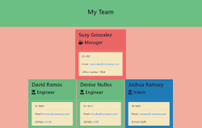

# Team Generator App 

## User Story

```
As a manager
I want to generate a webpage that displays my team's basic info
so that I have quick access to emails and GitHub profiles
```

## About this app:

This is a software engineering team generator command line application. The application will prompt the user for information about the team manager and then information about the team members. The user can input any number of team members, and they may be a mix of engineers and interns. This application must also pass all unit tests. When the user has completed building the team, the application will create an HTML file that displays a nicely formatted team roster based on the information provided by the user. 

 *  

## How to use: 
 
* On your console, open the Develop folder. To begin the prompts type: node app.js

* Answer the prompts accordingly if they don't apply you can leave it blank and enter for the next prompt. 

[](http://www.youtube.com/watch?v=nQ8QDFTF_gA "How to video")

[](https://badge.fury.io/js/node)

[](https://github.com/facebook/jest)
[](https://github.com/facebook/jest)

[](https://opensource.org/licenses/MIT)


